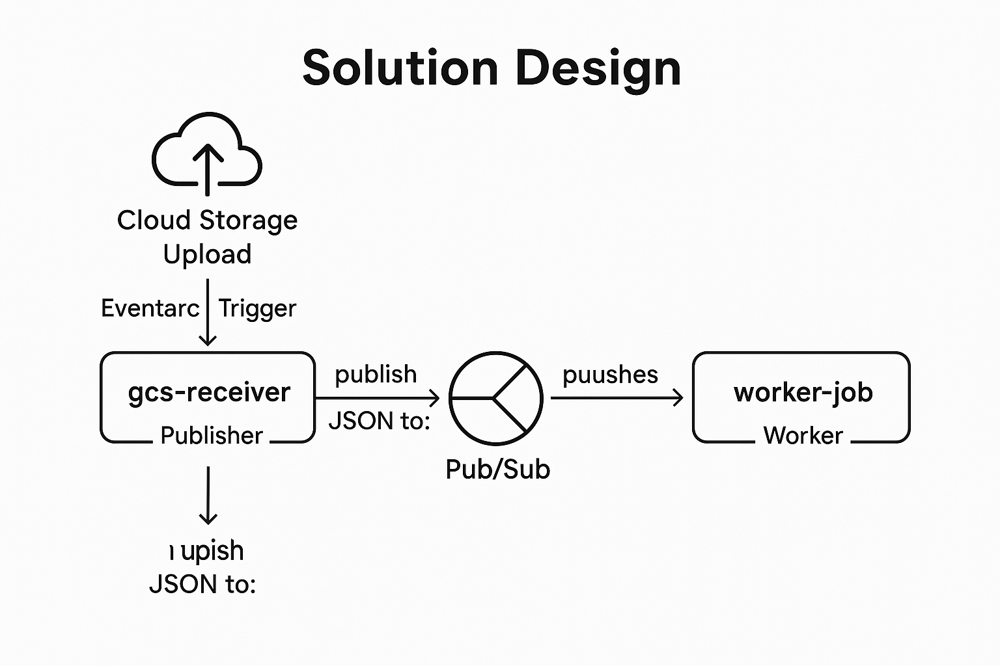

# gcs-event-to-pubsub

Cloud Storage to Cloud Run Job: Event-Driven Processing Pipeline

## Overview

This project implements a fully event-driven pipeline on Google Cloud that reacts to file uploads in a Cloud Storage bucket and triggers a long-running Cloud Run Job accordingly.

## Architecture

Cloud Storage(upload file) -> Eventarc Trigger(storage) -> Cloud Run(gcs-receiver) -> Pub/Sub(long-task-topic) -> Eventarc Trigger(pubsub) -> Cloud Run(dispatcher) -> Cloud Run Job(worker-job)



## Directory Structure
```text
gcs-event-to-pubsub/
├── dispatcher/           # Cloud Run service that launches the job
│   ├── main.py
│   ├── requirements.txt
│   └── Dockerfile
├── gcs-receiver/         # Cloud Run service that receives Cloud Storage events
│   ├── main.py
│   ├── requirements.txt
│   └── Dockerfile
├── worker-job/           # Cloud Run Job that does the long-running task
│   ├── main.py
│   ├── requirements.txt
│   └── Dockerfile
├── .env.template         # Environment variable sample
├── deploy.sh             # One-shot deploy script
├── cleanup.sh            # One-shot cleanup script
├── Makefile              # make deploy / make cleanup / make logs
└── .gitignore
```

## Key Technologies Used

- **Cloud Storage**: triggers on file upload
- **Eventarc**: routes events to services (receiver and dispatcher)
- **Pub/Sub**: message queue between receiver and dispatcher
- **Cloud Run**: used for short-lived `receiver` and `dispatcher`
- **Cloud Run Job**: used for long-running background processing
- **Flask + Gunicorn**: lightweight web servers

## Quick Start
### Setup
```
git clone https://github.com/kojimura/gcs-event-to-pubsub.git
cd gcs-event-to-pubsub

# Copy and configure environment variables
cp .env.template .env
vi .env
```

# Deploy
```bash
make deploy
```

# Trigger Job by Uploading a File
```bash
echo "test" > sleep_1min.txt
gsutil cp sleep_1min.txt gs://$BUCKET_NAME
```

# View Logs
```bash
make logs

# See logs of most recent job execution (replace EXEC_ID if needed)
LATEST=$(gcloud run jobs executions list --region=$REGION --format="value(EXECUTION)" --limit=1)
gcloud beta run jobs executions logs read "$LATEST" --region=$REGION

# View dispatcher logs
gcloud run services logs read dispatcher --region=$REGION --limit=50

# View gcs-receiver logs
gcloud run services logs read gcs-receiver --region=$REGION --limit=50
```

# Cleanup
```bash
make cleanup
```

## Notes

- Dispatcher sets `PUBSUB_MSG` env var when launching jobs.
- Worker parses the filename to determine how long to sleep.
- `gcs-receiver` parses CloudEvent and publishes JSON to Pub/Sub.
- IAM bindings were required to allow `dispatcher` to call `runWithOverrides`.
- Environment variable `GOOGLE_CLOUD_PROJECT` must be explicitly set in `dispatcher`.
